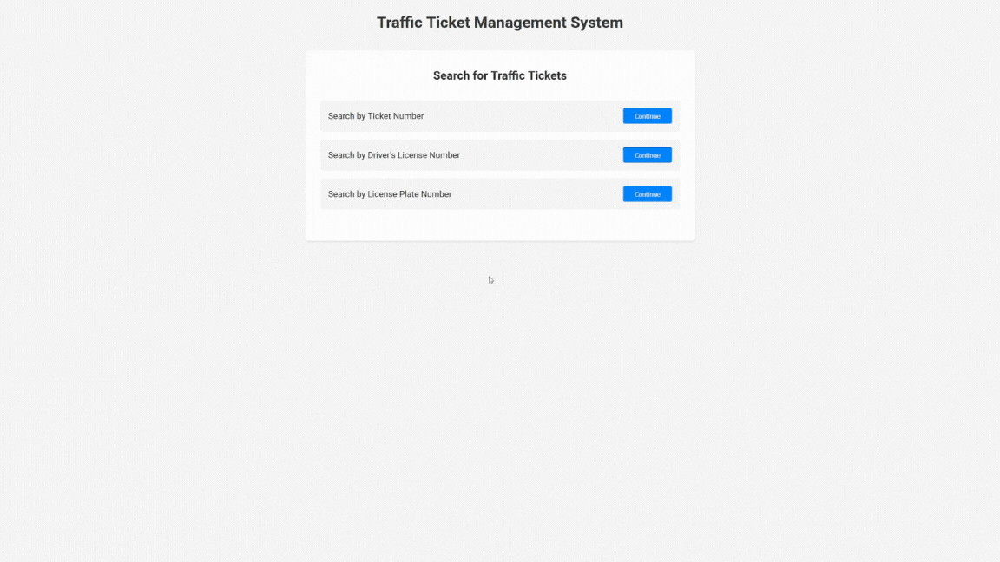

A project website where the user can search for traffic tickets and then "pay" them. I made the project to get some experience with Cursor, Angular, and Springboard. 

## Key Features
- Three search methods: ticket number, driver's license, or license plate
- Step-by-step search flow for better user experience
- Real-time ticket status updates
- Mock payment processing with confirmation
- Responsive design for all devices

## Technology Stack
- **Frontend**
  - Angular 
  - TypeScript
  - SCSS for styling
  - Reactive Forms for validation
  - Component-based architecture

- **Backend**
  - Java
  - Spring Boot
  - Spring Data JPA
  - RESTful API architecture
  - SQLite database

- **Testing**
  - JUnit 5
  - Mockito for unit testing
  - Spring Test for integration testing
